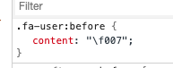

# fontawesomeArea

- [CSS content 属性](https://www.w3school.com.cn/cssref/pr_gen_content.asp)
- [字体文件类型](#font-file-type)
- [参考地址](#reference)

<h2 id="font-file-type">字体文件类型</h2>

- TTF (TrueType Font)
- OTF (OpenType Font)
- EOT (Embedded Open Type)
- WOFF (Web Open Font Format)
- SVG (Scalable Vector Graphics font)

<h2 id="reference">参考地址</h2>

- [Web 字体简介: TTF, OTF, WOFF, EOT & SVG](https://zhuanlan.zhihu.com/p/28179203)
- [CSS3 字体](https://www.runoob.com/css3/css3-fonts.html)
- [fontawesome guide](https://segmentfault.com/a/1190000013173840)
- [fontawesome search icons 4.7](https://fontawesome.com/v4.7.0/icons/)
- [fontawesome search icon free 5](https://fontawesome.com/icons?d=gallery&m=free)
- [Optimize Font Awesome to ridiculously low size of 10KB! ](https://blog.webjeda.com/optimize-fontawesome/)
- [icomoon](https://icomoon.io/app/#/select)
